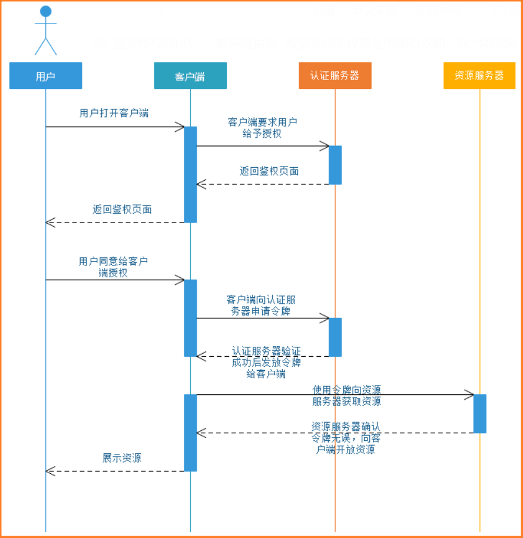
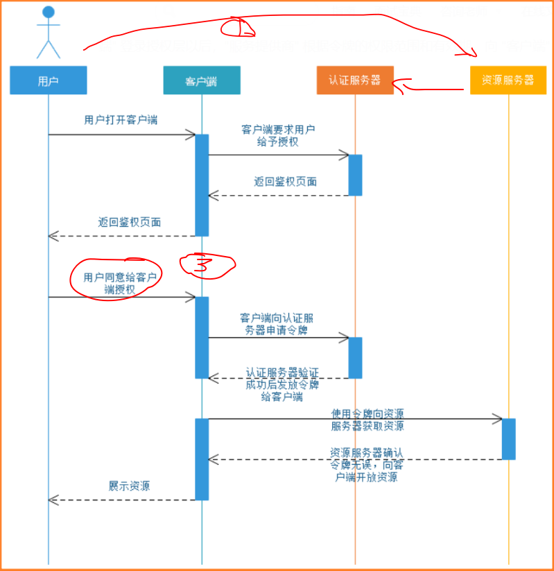
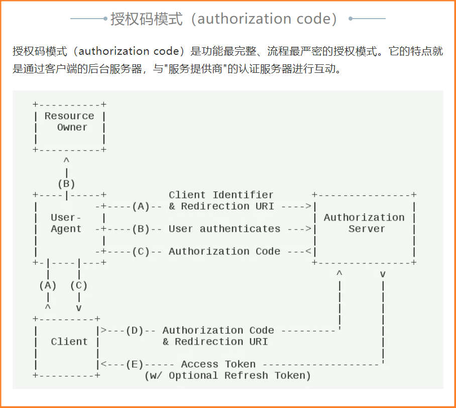
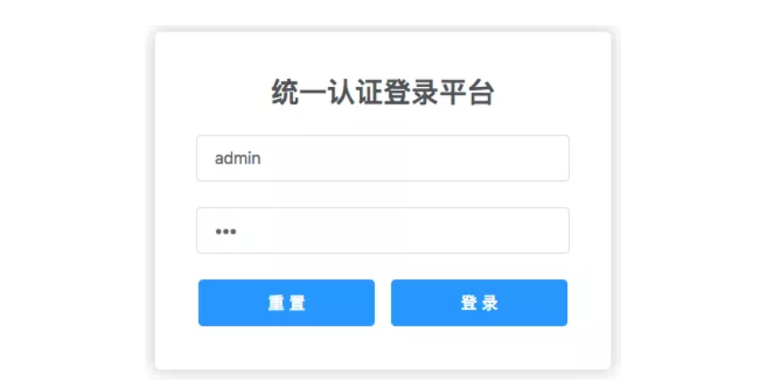
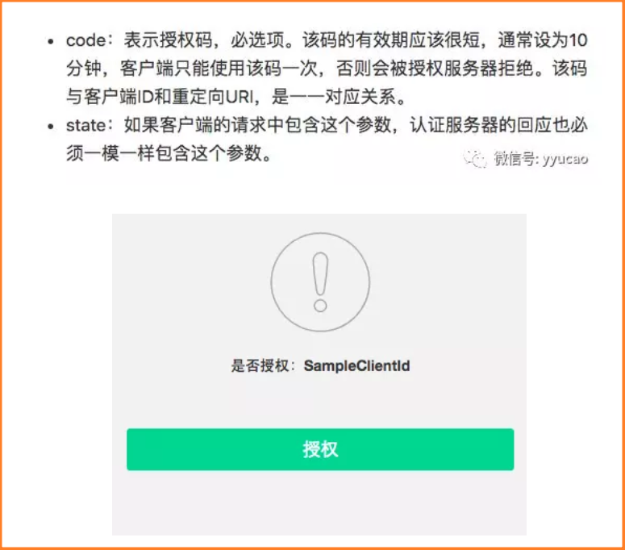
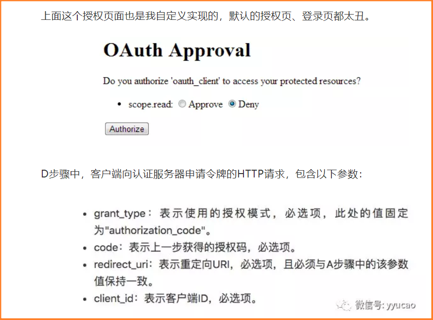
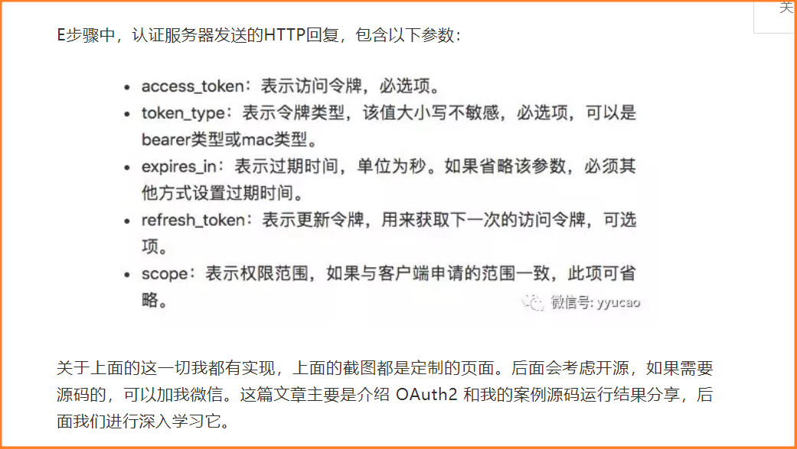

# 用户到底是访问的哪里?

看这幅图的时候,之前一直有一个误区,那就是我没有分清楚用户到底在访问哪一台服务器。以上图为例:

①如图用户在一开始**想要访问的是客户端相关服务!**用户打开客户端服务后,需要登录才能识别用户进而开始下一步操作,所以**现在需要进行认证**。进而用户点击通过qq进行登录才会发生后面一系列的操作!

这一步有可能是直接访问资源服务器,然后被导向认证服务器(这里要看资源服务器-服务提供者的后端逻辑),也可以直接去访问认证服务器!

③要理解这一步需要参考下面的"参考步骤"。

参考步骤

（A）用户访问客户端，后者将前者导向认证服务器。
（B）用户选择是否给予客户端授权。(就是填写qq号与qq密码)
（C）假设用户给予授权，认证服务器将用户导向客户端事先指定的"重定向URI"（redirection URI），同时附上一个授权码。
（D）客户端收到授权码，附上早先的"重定向URI"，向认证服务器申请令牌。这一步是在客户端的后台的服务器上完成的，对用户不可见。
（E）认证服务器核对了授权码和重定向URI，确认无误后，向客户端发送访问令牌（access token）和更新令牌（refresh token）。

在我这个系列教程中，当我们访问需要授权才能访问的地址：localhost:8882/index 时，会被重定向到 localhost:8881/auth/login 地址进行登录。登录后(**相当于qq填完qq号与密码或扫码完成按登录那一下,发出的请求**)就会跳转到 localhost:8881/auth/oauth/authorize?client_id=SampleClientId&redirect_uri=http://localhost:8882/login&response_type=code&state=Equf35 地址，进行授权。上面我罗列的这些参数都会携带。

C步骤中，服务器回应客户端的URI，包含以下参数：

# 第三方认证到底在干什么?

在第一次用第三方登录成功后,就是利用qq等的信息,在我们的系统中注册一个账号,将这个帐号与qq的账号关联起来。

第二次登录的时候还是老样子,先查看登录qq号是否与自己的库中有对应的账号,如果没有的话注册一个与qq对应的账号,如果有的话,那就读取这个帐号的相关信息。进行我们自己的业务操作!