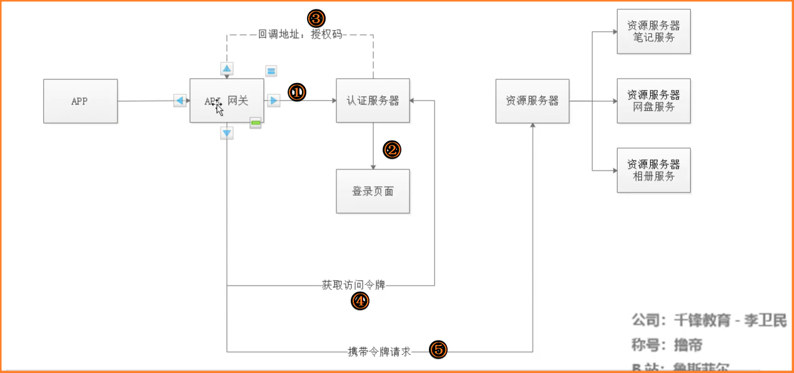
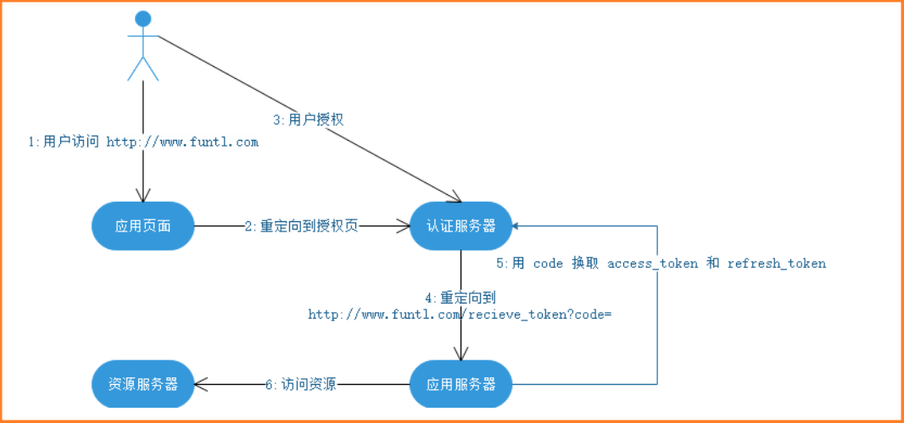
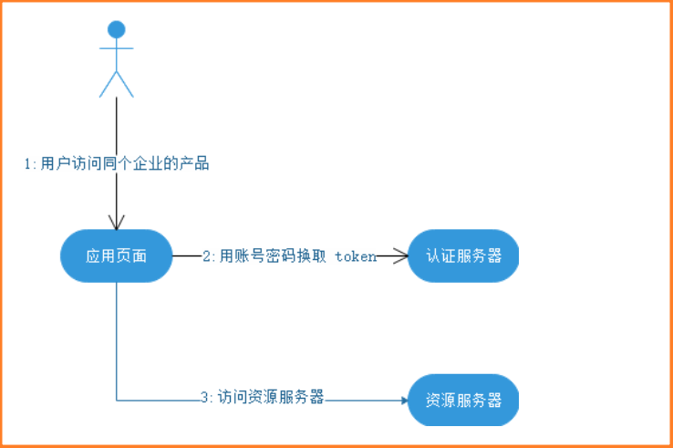
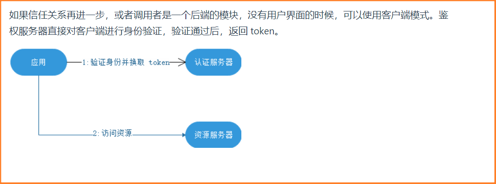

# 用户到底是访问的哪里?

看这幅图的时候,之前一直有一个误区,那就是我没有分清楚用户到底在访问哪一台服务器。以上图为例:

①如图用户在一开始**想要访问的是客户端相关服务!**用户打开客户端服务后,需要登录才能识别用户进而开始下一步操作,所以**现在需要进行认证**。进而用户点击通过qq进行登录才会发生后面一系列的操作!

这一步有可能是直接访问资源服务器,然后被导向认证服务器(这里要看资源服务器-服务提供者的后端逻辑),也可以直接去访问认证服务器!

③要理解这一步需要参考下面的"参考步骤"。

参考步骤

（A）用户访问客户端，后者将前者导向认证服务器。
（B）用户选择是否给予客户端授权。(就是填写qq号与qq密码)
（C）假设用户给予授权，认证服务器将用户导向客户端事先指定的"重定向URI"（redirection URI），同时附上一个授权码。
（D）客户端收到授权码，附上早先的"重定向URI"，向认证服务器申请令牌。这一步是在客户端的后台的服务器上完成的，对用户不可见。
（E）认证服务器核对了授权码和重定向URI，确认无误后，向客户端发送访问令牌（access token）和更新令牌（refresh token）。

在我这个系列教程中，当我们访问需要授权才能访问的地址：localhost:8882/index 时，会被重定向到 localhost:8881/auth/login 地址进行登录。登录后(**相当于qq填完qq号与密码或扫码完成按登录那一下,发出的请求**)就会跳转到 localhost:8881/auth/oauth/authorize?client_id=SampleClientId&redirect_uri=http://localhost:8882/login&response_type=code&state=Equf35 地址，进行授权。上面我罗列的这些参数都会携带。

C步骤中，服务器回应客户端的URI，包含以下参数：

# 第三方认证到底在干什么?

在第一次用第三方登录成功后,就是利用qq等的信息,在我们的系统中注册一个账号,将这个帐号与qq的账号关联起来。

第二次登录的时候还是老样子,先查看登录qq号是否与自己的库中有对应的账号,如果没有的话注册一个与qq对应的账号,如果有的话,那就读取这个帐号的相关信息。进行我们自己的业务操作!

# 授权码服务图解

无论哪种oAuth模式,最基本的要求是客户端再拿到access_token的时候

首先,这里面所有的服务器都是我们自己开发的

因为我们是为服务,所以肯定需要网关去聚合服务所以存在api网关

①首先app需要登录,那么就需要先访问认证服务器

②认证服务器提供一个登录页面

③等用户登录成功后(认证服务器会校验用户的用户名及密码),调用一个回调地址,**这个回调地址是我们在访问认证服务器的时候传递参数之一。**认证服务器回调,请求认证的服务是还是通过网关来完成的,并会返回一个授权码,其实这里就是**认证服务器(非浏览器)**发送了一个请求带上参数,授权码而已。

④当请求认证的服务器获得授权码之后,拿上授权码再去请求认证服务器,认证服务器对于本次请求会返回一个access_token

⑤当请求认证的服务器拿到令牌后,就可以去访问别的服务了,但是具体访问啥业务还是根据业务去判断的。

以上模式还有一个问题,那就是http协议是无状态的,那么我们怎样才能知道是哪个app访问了认证服务器或哪个app已经拥有的访问令牌呢?答案如下

授权码模式要求我们必须有自己的服务器,而授权码就保存请求授权的那台服务器上。而在微服务中,授权码久保存在api网关中。

# 密码模式

这种模式主要是针对自家应用的不同产品,为了实现不同产品不同登录页面的需求。

为什么要用密码模式呢?就以有道云笔记为例

有道云笔记可以通过用户名密码登录,也可以通过qq登录,那么这两者有什么区别呢?

此时有道云笔记的服务器就是客户端

通过用户名密码登录其实就是密码模式,因为对于有道服务器来说,有道云笔记是自己的产品,所以在自家产品的客户端上输入用户名密码,没有任何问题。而通过qq登录的时候,如果不使用授权码模式,qq提供一个他的登录页面,那么就得把qq密码输入客户端上,这样就增加了密码被盗用的风险。因为要请求qq服务器的资源,对于qq来说有道云笔记并不是自己服务器,所以不应该使用密码模式。

# 客户端模式

# 总结

以上的模式核心都是拿到一个能用的令牌!,只不过授权码模式,为了保证用户有自己的服务器,需要由认证服务器再调用我们自己的服务器一次(主要就是为了让我们的服务器接收到数据,因为回调的时候,没有服务器就没办法接收参数)。我们的服务器再根据授权码想认证服务器发送请求换取token。